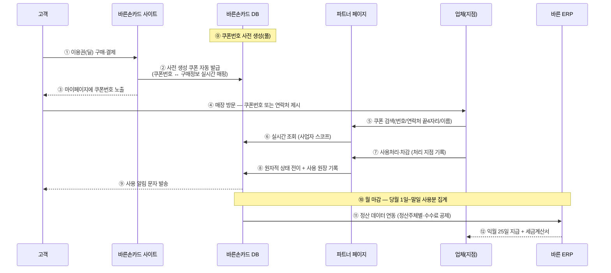

# 바른라운지 업체 관리자 — 기능 PRD (Feature PRD)

- **제품명:** 바른라운지 업체 관리자 (Partner Admin)
- **운영사:** (주)바른손카드
- **서비스:** 바른라운지 (뷰티/클리닉 소셜커머스)
- **문서 버전:** v0.2
- **기준일:** 2026-07-07
- **범위:** 입점 업체·바른손카드 직원용 운영 콘솔. 소비자 딜 판매·결제·쿠폰 발급은 바른손카드 본사 시스템 담당.
- **자매 문서:** [기술_PRD.md](기술_PRD.md) · [연동_명세_초안_20260707.md](연동_명세_초안_20260707.md) · [계약서_수정안_20260707.md](계약서_수정안_20260707.md)

> 본 문서는 **"무엇을 만드는가(기능)"**를 다룬다. **"어떻게 만드는가(스택·아키텍처·DB·로드맵)"**는 [기술_PRD.md](기술_PRD.md) 참조.

---

## 1. 개요 / 목적

바른손카드가 판매하는 소셜커머스 상품(일반형·금액형·횟수형 이용권)의 **입점 업체 운영**과 **바른손카드 내부 운영**을 위한 웹 어드민.

- **업체(vendor):** 자사 판매현황 확인, 고객 쿠폰 사용처리·차감, 정산 확인, 계좌/세금계산서 등록, 문의.
- **바른손카드 직원(staff):** 전체 매출/사용률/정산 모니터링, 업체 계정 발급, 공지 발행.
- **핵심 연결:** ① 사업자별 발급 계정 ↔ 지점 ↔ 판매분·정산 매핑 ② 사용 기준 정산 ③ 바른손카드 본사 시스템과의 **쿠폰 발급·사용·정산 실시간 연동**.

## 2. 서비스 플로우 (End-to-End)

### 2.1 연계 시스템

| 시스템 | 역할 |
|--------|------|
| **바른손카드 사이트** | 딜 판매·결제, 마이페이지(구매 쿠폰번호 노출) |
| **바른손카드 DB** | 쿠폰 **사전 생성(풀)**·발급·상태 원장 — 단일 진실원천 |
| **바른라운지 파트너 페이지** (본 제품) | 업체의 쿠폰 조회·사용처리, 판매현황·정산 조회 |
| **바른손 백오피스** ([bbarunsonweb /Company](https://bbarunsonweb.barunsoncard.com/Company)) | **업체 등록·계정 생성·수수료율** 마스터 → 바른 ERP 연동 |
| **바른 ERP** ([erp-backend](https://github.com/barunntechnicaloffice/erp-backend)) | 정산 집계·지급·세금계산서·회계 처리 |

### 2.2 쿠폰 생애주기 (구매 → 사용 → 정산)



1. **사전 생성·자동 발급:** 쿠폰번호는 바른손카드에서 미리 생성해 두고, 고객이 딜을 구매하면 자동으로 발급(코드 ↔ 구매정보 매핑)된다. **발급 즉시 파트너 페이지에서 검색 가능해야 한다(실시간 연동).**
2. **마이페이지:** 고객은 바른손카드 마이페이지에서 쿠폰번호를 확인하고 매장에 제시한다.
3. **사용처리:** 업체는 쿠폰번호 또는 고객 연락처로 조회한다 — 바른손카드 DB와 연동되어 있으므로 자기 사업자 쿠폰이면 즉시 사용처리·차감할 수 있다(F-04). 처리 지점이 기록되어 정산 귀속 기준이 된다.
4. **정산:** 당월 1일~말일 사용처리분이 **익월 25일** 지급된다(F-05). 정산 데이터는 **바른 ERP로 연동**되어 지급·세금계산서·회계 처리까지 이어진다.

### 2.3 업체 온보딩 플로우

```
바른손 백오피스(/Company)에 업체 등록 — 사업자 정보·수수료율·계정
        ↓ (업체 마스터 연동)
바른 ERP — 정산 지급 대상·수수료 기준 확보
        ↓ (계정 ↔ 사업자 ↔ 지점 매핑)
바른라운지 파트너 페이지 — 발급 계정으로 로그인, 지점 스코프 적용
```

- 업체 등록·계정 생성·수수료율의 **원천은 bbarunsonweb /Company**이며, 파트너 페이지 계정(F-02)은 이 업체 마스터와 매핑된다.

### 2.4 실시간 연동 요구사항

- **발급 즉시 검색:** 구매(발급) 시점과 파트너 페이지 검색 사이 지연 없음 — 쿠폰번호·구매 정보 실시간 연결.
- **사용처리 원자성:** 동시 처리에도 1건만 성공(중복 사용 차단), 상태는 바른손카드 DB가 단일 진실원천.
- **환불 즉시 반영:** 본사에서 환불 처리 시 파트너 페이지에서 즉시 사용 불가 상태로 표시.

### 2.5 본사(소비자 사이트) 측 요구사항 — 환불·만료 컴플라이언스

환불은 **고객 청구 기반**(자동 환불 의무 없음)이되, 아래 통지·창구가 법적 요건이다(신유형 상품권 표준약관).

- **만료 임박 자동 알림:** 유효기간 도래 전(D-30 필수, D-7 권장) 잔액·만료일·연장/환급 가능 안내 발송.
- **마이페이지 환불·연장 신청:** 미사용·부분사용 쿠폰의 환불 신청과 유효기간 연장 신청 버튼(연장은 특별한 사정 없으면 수용).
- **만료 후 환급 창구 유지:** 구매일로부터 **5년**(소멸시효)까지 90% 환급 청구 가능 — 만료 쿠폰을 마이페이지에서 숨기지 않는다.
- **소비자 이용약관:** 청약철회·환불·유효기간·연장 규정을 담은 B2C 이용약관 별도 제정 필요(업체용 약관과 별개).

## 3. 사용자 · 역할 (Roles)

| 역할 | 인증 | 접근 |
|------|------|------|
| **업체 (vendor)** | **발급받은 아이디/비밀번호** (자가 가입 없음) | 자기 사업자의 판매현황·쿠폰 사용처리·정산·명세서·문자이력·업체정보·문의·약관 |
| **바른손카드 직원 (staff)** | Google 로그인(내부) | 운영 대시보드·직원 콘솔(계정 발급/공지)·약관 |

- **계정 발급제 (2026-07-07 확정):** 자가 회원가입 없음 — 바른손카드가 **사업자(정산주체)별로** 계정 발급(F-02).
- **지점 스코프:** 계정에 운영 지점이 묶임 — 본사 사업자 계정=직영 지점들(처리 지점 선택), 가맹 사업자 계정=자기 지점(처리 지점 고정). 판매현황·정산·사용처리 검색 모두 자기 사업자 분만 조회.
- **역할 게이팅:** 직원 전용 화면(운영 대시보드·직원 콘솔)은 vendor 접근 차단.

## 4. 기능 요구사항

### F-01 로그인/계정 — 발급제 (자가 회원가입 없음)
- 발급받은 아이디(이메일)/비밀번호로 로그인. 셀프 가입·권한 신청 플로우 없음.
- **Google 로그인(직원 전용, role=staff)**, 세션 유지, 로그아웃. 계정 발급·비밀번호 문의 안내 노출.

### F-02 계정 발급 (직원 콘솔)
- 직원이 사업자명(정산주체)·사업자번호·담당자·아이디·초기 비밀번호·**운영 지점(복수 선택)**을 입력해 계정 발급.
- 발급 계정 목록 조회·**회수**(즉시 로그인 차단). 계정↔사업자↔지점 매핑이 판매분·정산 연동(MID 연결)의 확정점.
- **원천 시스템:** 업체 등록·계정 생성·수수료율은 바른손 백오피스([bbarunsonweb /Company](https://bbarunsonweb.barunsoncard.com/Company))에 등록되어 바른 ERP 업체 마스터와 연동된다(§2.3). 파트너 페이지 계정은 이 업체 마스터와 매핑.

### F-03 판매현황 (업체)
- 집계 KPI: 누적 판매, 사용 완료, 오늘 사용처리, 확정 매출.
- **상품별 판매 요약**(집계, 개인정보 미포함).
- **사용 내역 목록** — 사용(사용처리·차감)된 건만. **미사용 쿠폰의 고객 PII 노출 금지**(F-11 보안).

### F-04 쿠폰 사용처리 (업체)
- 조회: 쿠폰번호 / 연락처(끝 4자리) / 이름 / 통합.
- **일반형(service):** 1회 사용처리(판매가 전액).
- **금액형(amount):** 사용액 입력 후 **차감**(잔액·차감 내역 표시, 잔액 0이면 소멸).
- **횟수형(count):** 사용 회수 입력(기본 1회, 동반 시 복수) 후 **차감**(잔여 회수·회차 내역 표시, 잔여 0이면 소멸).
- **사용 범위(다지점, 2026-07-07 확정):** 쿠폰은 **판매한 사업자의 지점에서만** 사용 가능 — 직영 계열(사업자 1개·지점 다수)은 직영 지점 간 교차 사용(처리 지점 선택), **가맹점 쿠폰은 해당 가맹점 전용**(처리 지점 고정). 검색도 자기 사업자 쿠폰만 — 타 사업자 쿠폰이면 "OO에서만 사용처리 가능" 안내. 사용처리·차감 시 처리 지점 기록 → 정산 귀속 기준.
- 사용/차감 즉시 **고객 알림 문자 발송**(F-06, 서명 = 브랜드+처리 지점).
- **중복 사용 방지:** 두 지점 동시 처리 시에도 1건만 성공(본사 원자적 상태전이 + 멱등키).

### F-05 정산 (업체)
- 사용 기준 정산, **익월 25일** 지급. 다음 정산 예정액·사용월·건수, 정산 내역(라인별·사용 지점 표시).
- **정산주체별 지급 요약:** 직영점 사용분 = 본사 합산, 가맹점 사용분 = 각 가맹점 개별.
- 유형별 정산액 산정: [기술_PRD §3.1](기술_PRD.md) 참조.

### F-06 알림 문자 (SMS)
- 사용처리·차감·잔액소진 시 고객 연락처로 자동 발송.
- **알림 문자 이력**(일시/연락처/구분/내용).

### F-07 정산 명세서 (업체)
- 지급 단위 = **지급일 × 정산주체(사업자)** — 직영 합산 1건 + 가맹점별 각 1건.
- 정산 합계·상태(지급완료/예정), **명세서 CSV 다운로드**(사용 지점 포함), 세금계산서(정산주체별 발행 연동 예정).

### F-08 업체·정산 정보 (업체)
- 정산 계좌(은행/계좌/예금주), 세금계산서 정보(상호/대표자/사업자번호/업태/종목/주소/이메일), 담당자 연락처.

### F-09 공지사항
- 직원: 등록/삭제(상단 고정). 업체: 열람.

### F-10 1:1 문의
- 유형/연락처/제목/내용 → **mailto**(현) → 담당자. 연동 시 서버 접수.

### F-11 운영 대시보드 (직원)
- 총 매출액·총 정산액·**평균 쿠폰 사용률**·입점 업체 수.
- **업체별 현황:** 매출/발급/사용/사용률/정산액.

### F-12 약관·정산 안내
- 한 페이지 탭: 정산 방법 / 쿠폰 이용약관 / 환불·청약철회 / 입점·운영 약관.

## 5. 이용권 유형 (Voucher Types)

| 유형 | 코드 | 사용 방식 | 소멸 조건 | 정산 기준 |
|------|------|-----------|-----------|-----------|
| 일반형 | `service` | 1회 사용처리 | 즉시 | 판매가 전액 |
| 금액형 | `amount` | 액면 한도 내 금액 차감 | 잔액 0 | 차감액면 × (판매가 ÷ 총액면) |
| 횟수형 | `count` | 총 회수 한도 내 회수 차감 | 잔여 0 | 사용회수 × 회당단가, 완주 시 끝수 보정 |

## 6. 환불 정책 (컴플라이언트) — 결제액 기준

| 상황 | 환불 |
|------|------|
| 구매 후 7일 이내 · 미사용 | **100%** (청약철회, 전자상거래법 강행규정) |
| 7일 경과 ~ 유효기간 내 · 미사용 | **100%** (최소 90%) |
| 유효기간 경과 ~ 소멸시효(5년) · 미사용 | **90%** (신유형 상품권 표준약관) |
| 금액형 부분사용 | 잔액 **결제액 비례** |
| 횟수형 부분사용 | 결제액 × (잔여회수 ÷ 총회수), 기간 경과 시 90%. 계속거래(방판법 §31) 시 중도해지 — 위약금 법무 검토 중 |
| 업체 귀책(폐업·불이행) | **100%** |

- **미사용분은 정산하지 않음** → 환불로 인한 업체 역정산(환수) 없음.

## 7. 제품 로드맵 (마일스톤)

> 상세 근거·산정은 [기술_PRD §11 로드맵](기술_PRD.md) 참조.

| 마일스톤 | 시점 | 목표 | 기능 범위 |
|----------|------|------|-----------|
| **M0 — 파일럿 출시** | 차주 | 실서비스 오픈 | F-01~F-12 (현 스택). 본사 발급·조회 연동, 사용처리·정산 동작 |
| **M1 — 스택 정렬** | W1~W3 | donald-duck 규격화 | 기능 동결, 프론트/백엔드 재구축(무기능변경) |
| **M2 — 플랫폼 흡수** | W3+ (donald-duck 킥오프) | 도메인 편입 | `voucher`·`settlement` 도메인, 정산 엔진 복수모델 |

- **M0 선행 의존성:** 본사 사이트의 **딜 판매·쿠폰 발급 흐름**이 준비되어야 완전 연동 출시 가능. 미비 시 M0는 **발급 데이터 수동 주입 파일럿**으로 축소.

## 8. 미해결 (Open Questions — 기능 관점)

1. 횟수형 부분사용 중도해지 위약금 요율 (법무 확정 후 F-05/환불 반영).
2. 알림 채널 — SMS vs 카카오 알림톡, 템플릿 사전승인 일정.
3. 딜 옵션 구조 — 옵션 선택형 딜을 3종 유형에 매핑하는 방식.
4. 갑 법인명 통일 — 계약서 "(주)바른컴퍼니" vs 어드민 "(주)바른손카드".
